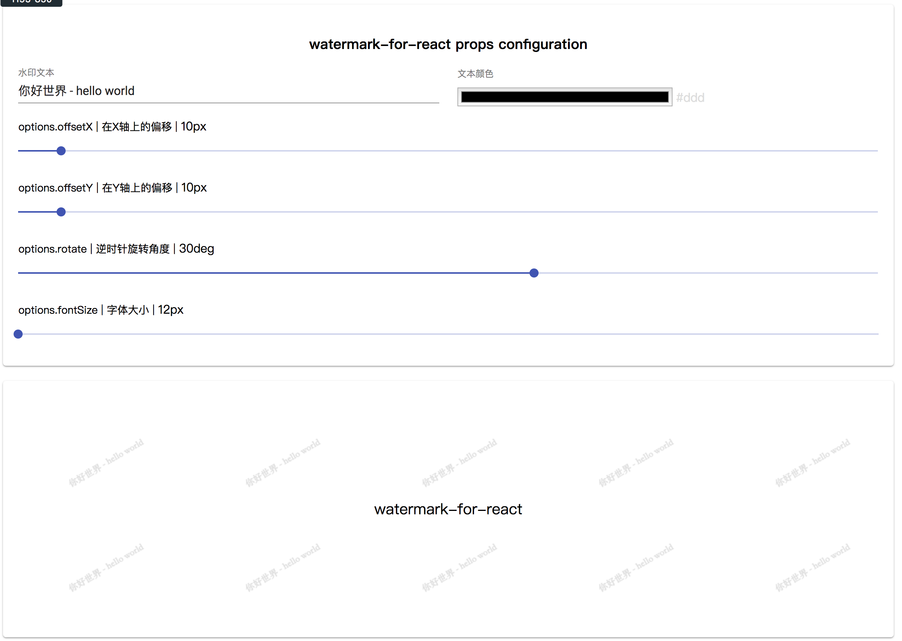

# watermark-for-react

English | [简体中文](./README-zh_CN.md)

>  watermark components

You can adjust the parameters on this [online example](https://pomelo-nwu.github.io/watermark-for-react/)



or you can `cd demo` and run this app 

## Installation
```js
npm install watermark-for-react --save
```

# 2. Usage

```jsx
import React from 'react';
import {WaterMarkProvider} from 'watermark-for-react';

const Demo =()=> {
    const text ='hello world' ;
    const options ={};
    return <WaterMarkProvider text={text} options={options}>
            <WaterMarkConsumer>
              text
            </WaterMarkConsumer>
    </WaterMarkProvider>
}
```
## options
